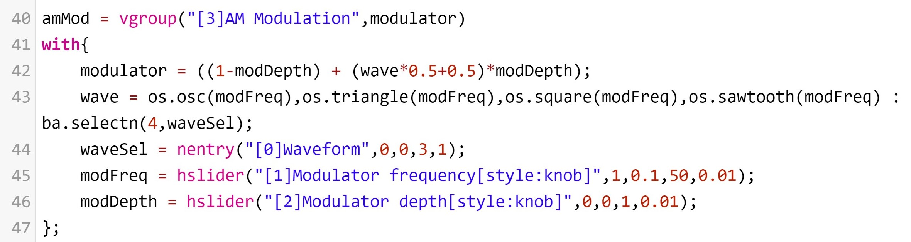
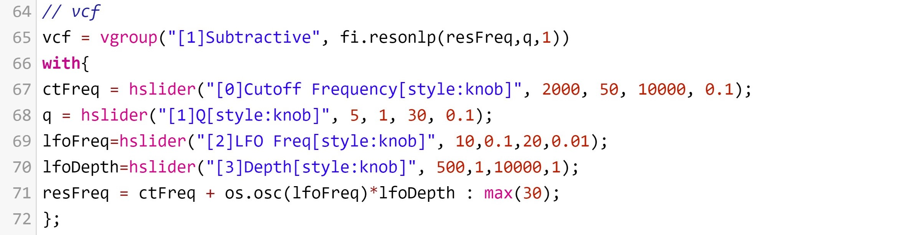
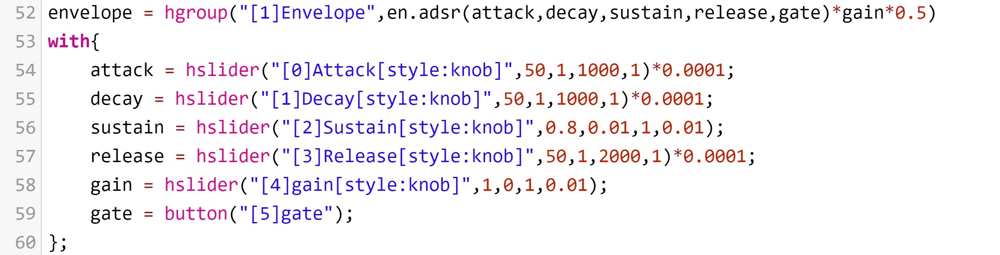

---
bibliography:
- aes2e.bib
title: SILK. Building a synth plugin in Faust
---

# INTRODUCTION

Synth plugins are used for synthesizing sounds with the help of
oscillators, different waveforms, filters, modulation and other tools.
They usually run within a DAW, and they are very often virtual
recreations of real hardware synths. The SILK plugin is the result of
our project for the course *Sound Synthesis: Building Instruments in
*Faust** in the summer semester of 2020 at TU Berlin. The main two goals
of the project were to develop our own synthesizer in the *Faust*
programming language and to take it into a plugin that could be used in
a DAW.

*Faust* (Functional Audio Stream) is a functional programming language
for sound synthesis and audio processing with a strong focus on the
design of synthesizers, musical instruments, audio effects, etc., and it
targets high-performance signal processing applications and audio
plug-ins for a variety of platforms and standards [@FAUST]. Using
*Faust* allows us to build complex signal processing algorithms in a
simple way: its compiler can "translate\" any *Faust* digital signal
processing (DSP) specification to a wide range of non-domain specific
languages. We get a very simple syntax and great libraries that contain
oscillators, effects, filters, and more ready to use. Finally, code
generated in *Faust* can be compiled in a wide variety of objects, such
as plugins, standalone apps, or smartphone apps.

The first part of this paper talks about the *Faust* code of our
synthesizer. Afterward, the workflow for obtaining a plugin from there
is presented.

# Faust Project

In this section we explain the code and algorithms of the *Faust*
project for SILK.

## Features Overview

SILK has three wave generators, four waveforms (sine, triangle, square
and sawtooth), a subtractive filter, AM modulation, an ADSR envelope,
reverb, and supports up to 32 simultaneous voices (see Figure
[1](#fig:silk_gui_qt){reference-type="ref"
reference="fig:silk_gui_qt"}).

{#fig:silk_gui_qt width="35%"}

## Process Line

Before we dive into the individual parts that are involved in the signal
processing of our synthesizer, let's take a look at the bigger picture.
The most fundamental part of any *Faust* program is the *process* line.
In this part of the code, we pass the desired inputs and outputs to the
target. This is a dynamic system, meaning that we can just type in any
number and arrangement of inputs and outputs at the right side of the
equal sign, and it will adjust to it providing the program with inputs
and outputs as needed [@FDOC].

The diagram in Figure [2](#fig:process){reference-type="ref"
reference="fig:process"} shows the last stage of the process line. The
block named *synthTypes* contains the output signal of the sound
synthesis process in our synthesizer. The envelope is applied to our
signal using the multiplication box and after that, the line splits in
two. These two lines will be used as an input by the *effect* element
(see Section [2.8](#subsec:reverb){reference-type="ref"
reference="subsec:reverb"} for more about this).

{#fig:process width="30%"}

If we take a look inside the *synthTypes* block, we will see the diagram
shown in Figure [3](#fig:process1){reference-type="ref"
reference="fig:process1"}. Here, the oscillator synthesis signal
(*oscSynth*) is multiplied by the AM (*amMod*) and the subtractive
filter (*vcf*), with the particularity that the latter can be bypassed.

{#fig:process1 width="45%"}

## Oscillator Synthesis

The basic *Faust* code that is used for generating waves in SILK is
presented in Figure [4](#fig:osc_synth_1){reference-type="ref"
reference="fig:osc_synth_1"}. In lines 13 to 16, we define the four
different waveforms that will be available for synthesizing sound: sine,
triangle, sawtooth and square. For the sine and triangle waves we added
overtones in order to obtain a richer tone.

{#fig:osc_synth_1 width="50%"}

Subsequently, three wave generators are created using this generic
*waveGenerator* function (see Figure
[5](#fig:wavegens){reference-type="ref" reference="fig:wavegens"}).
Having multiple wave generators to use simultaneously allows users of
SILK to further shape their own tone.

{#fig:wavegens width="50%"}

## AM Modulation

AM (Amplitude Modulation) consists in modulating the amplitude of a
given wave with another wave that is called *modulator*. The *Faust*
code for the implementation of the AM in SILK is presented in Figure
[6](#fig:am_mod){reference-type="ref" reference="fig:am_mod"}.

{#fig:am_mod width="50%"}

To which extent the modulation is done, is specified by the *modulation
depth* parameter. We are also able to choose which waveform we want to
use for modulating, and at which frequency.

## Subtractive Filter

Subtractive synthesis is the process of taking an initial, harmonic-rich
tone, and subtracting parts of it using filters and other tools in order
to create a musical timbre[@SUBT]. Our synth has a virtual *vcf*
(Voltage Controlled Filter) that has four parameters: *cf* (cut-off
frequency), *q*, *lfoFreq* and *lfoDepth* (see Figure
[7](#fig:sub_fil){reference-type="ref" reference="fig:sub_fil"}). We
take advantage here of *fi.reson.lp*, a simple resonant lowpass filter
based on tf2s (virtual analog) of the *Faust* libraries.

{#fig:sub_fil width="50%"}

## Envelope

The SILK integrates an ADSR envelope at the final stage of the process
line (see Figure [2](#fig:process){reference-type="ref"
reference="fig:process"}). ADSR envelopes (*Attack, Decay, Sustain* and
*Release*) are the usual way to implement gain envelopes in
synthesizers, and they basically set a time for each of the *attack*,
*decay* and *release* parameters and a percentage for the *sustain* one.

An ADSR envelope can be easily implemented in *Faust*. We just have to
use the *adsr* object of the envelope library in *Faust* (see Figure
[8](#fig:envelope){reference-type="ref" reference="fig:envelope"}).

{#fig:envelope
width="50%"}

## Polyphony

If we take a closer look at the code of the envelope, we see that we
have multiplied the gain of our envelope by 0.5 (see figure
[8](#fig:envelope){reference-type="ref" reference="fig:envelope"}). This
is because synthesizers make use of polyphony, that is, several notes
played at the same time. If we do not reduce the overall gain of our
process line, the gain of the different notes will add up without being
scaled, which can end up causing clicking.

In order to enable our program to receive MIDI input, we have to set the
*Poly Voices* field in the configuration of the *Faust* compilation to
the desired number of simultaneous voices. By default this is set to
*Mono*, which doesn't take any MIDI input. For our synthesizer, we set
it to 32 voices.

## Reverb {#subsec:reverb}

So we already have a polyphonic synth and we want to add a reverb. We
might be tempted to put a reverb element at the end of our process line,
but that would be wrong. It would be very inefficient, because it would
apply the effect to each single note. Instead, by defining an *effect*
element anywhere in the code, a global audio effect will be applied to
all the polyphonic voices at once. Also notice that the number of
outputs of our process line has to be the same as the inputs to the
effect line. We used the *zita_light* reverb (see Figure
[2.8](#subsec:reverb){reference-type="ref" reference="subsec:reverb"}),
that has a stereo input, and thus we have to provide two outputs at the
end of our process line (See figure
[2](#fig:process){reference-type="ref" reference="fig:process"}).

{#fig:audio_effect
width="50%"}

# IMPLEMENTATION

There are several approaches to generating a plug-in instrument using
FAUST. Since our goal was to have the synth usable for audio production
inside a Digital Audio Workstation (DAW) and we had access to Logic Pro
X, which only supports the Audio Unit format (AU) natively, we decided
to aim for this format. Because there exists the faust2au script, which
should provide a great FAUST plug-in in the desired format, our first
attempt included trying to get this approach to work. However, at the
time of the project (Summer 2020), we were not successful in this
approach, which led us to trying the alternatives we will introduce in
this paper. The different approaches yield different results and come
with individual advantages and drawbacks which we will examine, too.

## faust2vst

The first workaround we employed is a fairly simple approach to the
problem of Logic Pro X not being able to utilize other formats besides
AU: We build a plug-in in the vst format using the faust2vst script and
run it using a wrapper plug-in. We developed the code in the *Faust IDE*
online editor, which held the advantage of not needing to install
Steinberg's vst development kit. Using the *Faust IDE's* option to
export and compile to a specific platform binary code, we chose *osx* as
the platform and *vst* or *vsti* as the architecture. Unlike the
aformentioned faust2au script, the vst option built without any
problems. After exporting using the **Faust* IDE*, we can now download
the export. The download contains the vst(i) file as well as a makefile
and the FAUST code. We now place the vst file in the folder, that is at
the end of the path, where our DAW scans for vst plug-ins. For Mac users
it should be Library $>$ Audio $>$ Plug-Ins $>$ VST. If your DAW is
already able to run vst plug-ins, you are now set and ready to go.
However we now still had to translate our plug-in to the AU format. To
achieve this we had to make use of a plug-in, that is able to run other
plug-ins, especially vst plug-ins. For this purpose we used DDMF's
Metaplugin [@DDMF2021]. In the following section we will discuss the the
steps taken using Metaplugin, however we believe that using other
wrapper plug-ins will result in a similar workflow.

Firstly we have to open Metaplugin inside our DAW. Since we are using
Logic, we select the instrument slot inside the channel-strip. Here, we
select AU-Instruments $>$ DDMF $>$ MetaPluginSynth. If you are building
an effect plug-in, make sure to open Metaplugin from the Audi FX space,
choosing Audio Units $>$ DDMF $>$ Metaplugin. If the plug-in is not
available in the menu, you may need to rescan your plug-in by choosing
Logic Pro $>$ Preferences $>$ Plug-In Manager, or MainStage $>$
Preferences $>$ Plug-In Manager (if you are using Logic Pro X as well).

Secondly, having opened the MetaPluginSynth, we check whether our vst is
available. If it is not, we need to scan inside the plug-in. To do so,
we select Options \> Scan for new or updated VST plug-ins. You might
need to select which folder to scan. Choose the one in which you have
placed your vst file. If you are using a Mac, you might encounter the
problem of macOS not being able to verify whether your vst file contains
malware, which results in your vst file not being opened inside the
Metaplugin. You can choose to open it nevertheless from your safety
settings. Once your mac has tried opening it from the safety settings,
you can scan again and continue. 3. Now our plug-in is visible inside
the MetaPluginSynth, from where you can open it. Make sure to connect
your plug-in with the required in- and outputs inside the
MetaPluginSynth. Your plug-in should be ready to use now.

At the time of this project (Summer 2020) we encountered a few problems
regarding this workflow: The most noticeable one may be that, contrary
to the GUIs of of other targets, all elements of the GUI of the final
vst are sliders that are placed below each other, making layout of and
operating the synth significantly counterintuitive. Furthermore, the
slider values are all placed between zero and one, which makes precise
settings fairly difficult.

Another drawback of this workaround is the missing midi support: In
order to actually play our synth, one has to select the frequency and
other parameters using the sliders beforehand and move the main gate
slider above the .5 threshold. This is due to the GUI element of a
switch being turned into a slider element. However, this approach also
has a lot of advantages: The time it takes to move from FAUST code to a
usable plug-in is considerably fast, making it useful for prototyping
and testing FAUST coded plug-ins. There is also, apart from FAUST
knowledge, no further coding knowledge required, making it easy for
beginners to built a plug-in by themselves. There is also no need for
additional installations and further programming. We believe that
despite the shortcomings regarding the missing MIDI functionality the
workflow still holds value especially for audio effects development.
However, the challenging layout and operating might prove useful or
inspiring for the creation of drone sounds.

## faust2juce

This approach consists of three steps:

1.  Getting a basic Juce plug-in running in Logic Pro X

2.  Exporting the FAUST code as faust2juce

3.  Adding the faust2juce code to the juce project.

As with the preceeding workflow of faust2vst, this approach works on a
Mac with Logic Pro X. In addition Xcode and JUCE are needed to follow
through with this example. Another IDE might work as well, you might
however need to take extra steps.

Firstly, we install JUCE [@JUCE2021] and open up the Projucer. There we
select New Project $>$ Plug-In $>$ Basic, choose a name and click
'Create Project'. Now we set all module paths to global and select Xcode
as our selected exporter. Inside of the settings under Plugin
Characteristics we select 'Plugin is a Synth', 'Plugin MIDI Input', and
'Plugin MIDI Output'. We now add a company name and click on the button
to open the project inside our preferred IDE. When using Logic Pro X,
the company name decides where a plug-in can be found inside of Audio FX
$>$ Audio Units in the Channel Strip. Now in Xcode, we change the scheme
to 'AU' using the dropdown menu in the upper left corner. Inside the
same menu, we select 'Edit Scheme'. We now select Logic Pro X (our
preferred DAW) as our executable. This allows us to automatically open
up the plug-in inside of our DAW once Xcode finishes building. We now
deselect 'debug executable'. Finally, we can press 'Build' and open up
Logic Pro X. Occasionally, a plug-in cannot be found under a specified
company name. In this case, deleting the cache file under Library $>$
Caches $>$ AudioUnitCache and restarting the Mac might work. Upon
reopening Logic Pro X, the program should automatically scan the
plug-in. We should now be able to open the plug-in. It should contain a
blank space and the text \"Hello World!\". Since we are building our
workflow around using JUCE, it takes more time learning and the
start-to-end process is also delayed. However, JUCEs varied
possibilities ultimately allow for the user to customize their GUI with
far more precision than other workflows.

# CONCLUSION

Ultimately, we have managed to achieve our goal of building a functional
synth plugin and running it in our DAW. However, our approaches
contained some drawbacks: The playability of the synth is limited, due
to missing compatibility with MIDI inputs. Also, our processes of
compiling the FAUST code to a certain target and taking it from there to
a plugin format proved to be a little challenging for coding beginners,
although one could argue, that starting coding in general can be
considered tedious, independent of plattforms. We hope that this paper
adds to the body of knowledge concerning FAUST and aids the
simplification of getting started. Nevertheless, using FAUST provided
quite a few opportunities for programming and prototyping use: the
language itself demonstrates ease of use due to its intelligibility.
Adding to the diverse capabilities of FAUST, the supporting libraries
greatly increased the scope of application and reduced programming
efforts. Accelerating the workflow especially for beginners, even
considering the obstacle of challenging workflows is also a major
benefit of FAUST. Considering the missing MIDI support of our workflow
we can take a look at the existing body of knowledge present.
Apparently, Weiß and Körwer [@Weiss2020] managed to find a workflow
providing MIDI support for FAUST based plugins.
